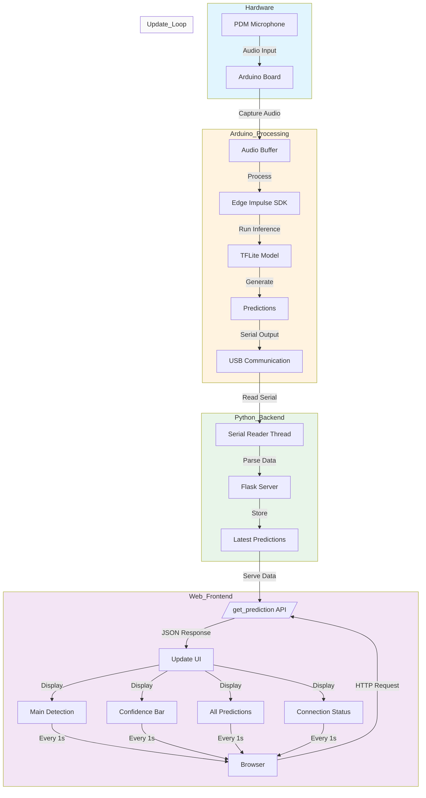

# Animal Sound Detector 🫎

## Team Members 👪

 Member 1: SREYA V - Mar Athanasius College Of Engineering, Kothamangalam

 Member 2: ALEENA MARY ANIL - Mar Athanasius College Of Engineering, Kothamangalam


 Member 3: NANDANA JAYACHANDRAN - Mar Athanasius College Of Engineering, Kothamangalam

## Hosted Project Link 🔗

```bash
sreya2005.pythonanywhere.com

```


## Project Description 📖


"When Nature Speaks, We Listen—Decoding the Wild."
Ever wondered what the wild is trying to tell you? 🌿🔊 Our Animal Sound Detection System deciphers nature’s soundtrack—identifying wildlife in real time for safety, research, and conservation—because when nature speaks, we make sure you hear it! 🦉🐾✨

Imagine a world where technology understands the language of animals, unlocking insights from the sounds of nature. Our AI-powered Animal Sound Detection System uses TinyML, Edge Impulse, and Arduino BLE 33 to analyze and classify wildlife sounds in real time. Whether for research, conservation, or safety, this intelligent system helps bridge the gap between humans and nature—because understanding the wild starts with listening.


## Problem Statement ⚠️

Nature speaks, but are we really listening? In rural areas and wildlife reserves, identifying animal sounds can mean the difference between safety and danger or conservation and extinction. Yet, existing systems are bulky, expensive, and hard to deploy in remote locations. This lack of efficient monitoring makes it difficult to track animal behavior, detect threats, or gather crucial ecological data in real time.

The challenge? We need a smarter, portable, and cost-effective solution—one that can instantly recognize animal sounds, providing early warnings and valuable insights into the wild like never before!

## The Solution 🎯

### Nature’s Own Shazam! 🎵🐾

Imagine walking through a forest and hearing a mysterious growl—what if your device could instantly tell you, "That's a leopard nearby, better stay alert!" or "Relax, it's just a monkey arguing with its friends."

That’s exactly what our Smart Animal Sound Detection System does! Using Arduino BLE33, it listens to the wild, identifies animal calls, and tells you who’s making all that noise. Think of it as Shazam for wildlife! 🎶🔍

Lightweight, portable, and budget-friendly, this system works anywhere—whether for safety, conservation, or just satisfying your curiosity. From detecting predators to tracking rare species, it’s your personal wildlife detective on the go! 🌿🦉🚀


## Techinical Details

## Software Components
### Languages
    •	Python 3.x

    •	JavaScript

    •	C++ (Arduino)

    •	HTML/CSS

### Frameworks
    •	Flask (Python web framework)

    •	Edge Impulse (Machine Learning framework)

### Libraries

 •	Python Libraries: 

    o	pyserial: Serial communication with Arduino

    o	threading: Concurrent operations

    o	gunicorn: WSGI HTTP Server

•	Arduino Libraries: 

    o	PDM: Digital microphone interface

    o	EdgeImpulse SDK: ML model inference

    o	TensorFlow Lite: ML model runtime

### Development Tools
    •	Arduino IDE

    •	Python package manager (pip)

    •	Web browser

    •	Text editor/IDE

    •	Edge Impulse Studio

## Hardware Components
### Main Components

•	Arduino Board (recommended: Arduino Nano 33 BLE Sense)

o	Specifications: 

    	Processor: nRF52840 from Nordic Semiconductors

    	Operating Voltage: 3.3V

    	Digital I/O Pins: 14

    	PDM Microphone Support

    	USB Connection

•	PDM Digital Microphone 

o	Specifications: 

    	Sampling Rate: 16 kHz

    	Mono Channel

    	Configurable Gain (set to 127 in code)

    	Buffer Size: 4096 bytes

### Tools Required
    •	USB Cable (for Arduino connection)

    •	Computer with USB port
    
    •	Internet connection (for initial setup)


## TinyML

## Animal Sound Classification Model Architecture

### Feature Extraction: Mel-filterbank Energy (MFE)

### Optimized Parameters

#### Frame length: 0.025s (25ms)

Provides better temporal resolution for audio analysis
Standard in speech/audio processing for capturing phonetic transitions


#### Frame stride: 0.010s (10ms)

60% overlap between consecutive frames
Ensures smooth temporal transitions


#### Number of filters: 64

Increased spectral resolution
Better frequency band separation
More detailed representation of the audio spectrum


#### FFT length: 512 points

Higher frequency resolution

Better spectral detail capture

Good balance between computation and detail


#### Frequency range: 50Hz - 10000Hz

Low frequency cutoff (50Hz) removes environmental noise

High frequency ceiling (10000Hz) captures animal vocalizations

Covers most animal sound frequencies


#### Noise floor: -90dB

Good dynamic range for capturing quiet sounds

Helps in distinguishing subtle audio features


### Feature Generation Process

Audio signal segmentation into 25ms frames

Hamming window application to reduce spectral leakage

FFT computation (512-point)

Mel-filterbank application (64 filters)

Energy calculation per filter

Logarithmic compression

Per-feature normalization

### Model Architecture: 2D Convolutional Neural Network
### Network Structure

### Input Layer

#### Shape: (Time frames × 64 mel filters)

Represents time-frequency distribution


### Convolutional Layers

Multiple 2D convolution blocks

Each block typically contains:

2D Convolution

Batch Normalization

ReLU Activation

Max Pooling


#### Dense Layers

Flatten layer to convert 2D features to 1D

Multiple dense layers with dropout

Final softmax layer for classification


### Advantages of 2D CNN for Audio

#### Pattern Recognition

Captures both time and frequency patterns

Learns hierarchical features

Robust to small time shifts


#### Feature Learning

Automatic feature extraction

Learning of relevant patterns

Time-frequency relationship preservation


#### Efficiency

Parameter sharing reduces model size

Suitable for embedded deployment

Fast inference on microcontrollers


### Training Process

#### Dataset Preparation

#### Audio Preprocessing

Resampling to consistent rate

Silence removal

Background noise reduction

Volume normalization


#### Feature Extraction

MFE computation with optimized parameters

Feature normalization

#### Data augmentation techniques:

Time shifting

Pitch shifting

Speed perturbation

Noise addition


### Training Strategy

#### Model Training

Cross-validation for robustness

Early stopping to prevent overfitting

Learning rate scheduling

Batch size optimization


### Quantization

#### Post-training quantization

Int8 quantization for microcontroller deployment

Minimal accuracy loss


### Performance Metrics

Classification accuracy

Confusion matrix analysis

Inference time monitoring

Model size optimization


### Edge Impulse Deployment

#### Model Conversion

TensorFlow Lite conversion

Optimized for Arduino deployment

Memory footprint reduction


#### Inference Optimization

Buffer management

Efficient audio capture

Real-time processing capabilities## Implementation
### Software Installation

1.	Clone the repository:

```bash
git clone https://github.com/sreya20055/animal_sound-detector.git

cd animal-sound-detector
```
2.	Install Python dependencies:

```bash
pip install -r requirements.txt
```

3.	Arduino Setup: 

    o	Install Arduino IDE

    o	Install required board support package for your Arduino

    o	Install Edge Impulse Arduino library

    o	Upload the model file through Edge Impulse Studio

### Running the Application

1.	Upload Arduino Code: 

    o	Open AnimalSoundDetector.ino in Arduino IDE

    o	Select correct board and port

    o	Click Upload

2.	Start Flask Server:

```bash
# Development mode
python app.py
```

3.	Access Web Interface: 

    o	Open web browser

    o	Navigate to http://localhost:5000

### Configuration Notes

1.	Serial Communication: 

    o	Baud Rate: 115200

    o	Auto-detection of USB port

    o	Timeout: 1 second

2.	Audio Processing: 

    o	Frame Size: Defined by model

    o	Sample Length: Variable based on model requirements

    o	Gain: 127 (maximum sensitivity)

3.	Web Interface: 

    o	Updates every 1 second

    o	Supports multiple prediction display
    
    o	Real-time confidence visualization


## Screenshots


## Diagrams



## Schematic & Circuit


## Build Photos


## Video

```bash 
https://drive.google.com/folderview?id=1XzUwpCCM4k7AlxwoEtwJ4cpaDXm_r0Gy
```
## Team Contributions

Sreya V- TinyML

Aleena Mary Anil - Documentation

Nandana Jayachandran - Web


## Badges

[](https://choosealicense.com/licenses/mit/)
[](https://opensource.org/licenses/)
[](http://www.gnu.org/licenses/agpl-3.0)


## License

[MIT](https://choosealicense.com/licenses/mit/)

